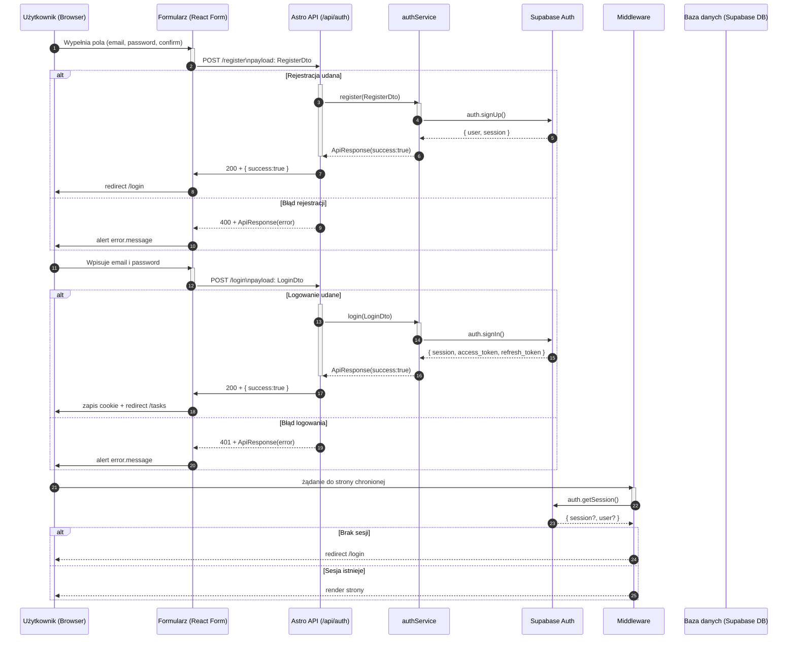

```mermaid
sequenceDiagram
    autonumber
    participant U as Użytkownik (Browser)
    participant F as Formularz (React Form)
    participant API as Astro API (/api/auth)
    participant Svc as authService
    participant SB as Supabase Auth
    participant MW as Middleware
    participant DB as Baza danych (Supabase DB)

    %% Rejestracja
    U->>F: Wypełnia pola (email, password, confirm)
    activate F
    F->>API: POST /register\npayload: RegisterDto
    deactivate F

    alt Rejestracja udana
      activate API
      API->>Svc: register(RegisterDto)
      activate Svc
      Svc->>SB: auth.signUp()
      deactivate Svc
      SB-->>Svc: { user, session }
      Svc-->>API: ApiResponse(success:true)
      deactivate API
      API->>F: 200 + { success:true }
      F->>U: redirect /login
    else Błąd rejestracji
      API-->>F: 400 + ApiResponse(error)
      F->>U: alert error.message
    end

    %% Logowanie
    U->>F: Wpisuje email i password
    activate F
    F->>API: POST /login\npayload: LoginDto
    deactivate F

    alt Logowanie udane
      activate API
      API->>Svc: login(LoginDto)
      activate Svc
      Svc->>SB: auth.signIn()
      deactivate Svc
      SB-->>Svc: { session, access_token, refresh_token }
      Svc-->>API: ApiResponse(success:true)
      deactivate API
      API->>F: 200 + { success:true }
      F->>U: zapis cookie + redirect /tasks
    else Błąd logowania
      API-->>F: 401 + ApiResponse(error)
      F->>U: alert error.message
    end

    %% Middleware i ochrona routingu
    U->>MW: żądanie do strony chronionej
    activate MW
    MW->>SB: auth.getSession()
    deactivate MW
    SB-->>MW: { session?, user? }

    alt Brak sesji
      MW-->>U: redirect /login
    else Sesja istnieje
      MW-->>U: render strony
    end
```